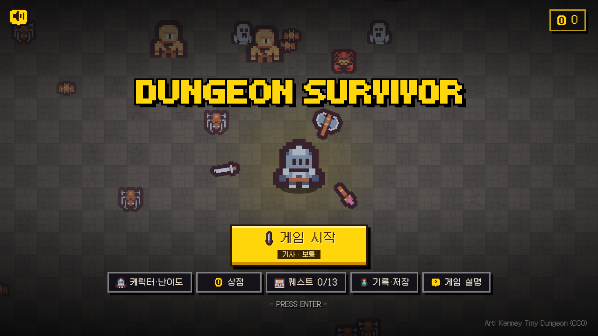
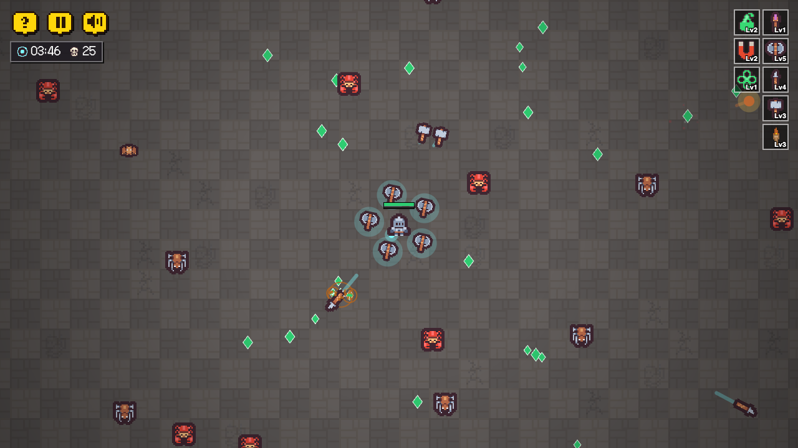

# DUNGEON SURVIVOR

던전에서 몰려오는 몬스터를 피하며 무기를 모으고 키우는 뱀서류(뱀파이어 서바이버 방식) 생존 게임입니다.
설치 없이 브라우저에서 바로 할 수 있고, PC와 휴대폰 모두 지원합니다.

**지금 하기**

https://cmj1203.github.io/survivor-game





## 어떤 게임인가요

- 캐릭터는 움직이기만 하면 됩니다. 공격은 무기가 알아서 합니다.
- 몬스터를 잡으면 나오는 보석을 주우면 레벨이 오르고, 새 무기나 아이템을 하나 고릅니다.
- 무기와 아이템을 잘 짝지으면 무기가 더 센 모습으로 진화합니다.
- 한 판이 끝나면 금화를 받고, 그 금화로 다음 판을 더 유리하게 시작할 수 있습니다.

| 항목 | 개수 | 설명 |
|---|---|---|
| 무기 | 23종 | 마법 지팡이, 도끼, 번개 등. 일부는 퀘스트로 열립니다 |
| 진화 무기 | 20종 | 무기 + 맞는 아이템 조합으로 진화 |
| 아이템(패시브) | 16종 | 공격력, 이동 속도, 자석 범위 등 능력치 강화 |
| 캐릭터 | 4명 | 기사, 사냥꾼, 광전사, 성녀 |
| 난이도 | 4단계 | 보통(던전), 어려움(얼음 동굴), 매우 어려움(용암 굴), 지옥(저주받은 어둠). 난이도마다 배경과 적의 모습·특성이 달라집니다 |
| 퀘스트 | 27개 | 달성하면 무기·캐릭터가 열리거나 금화를 받습니다 |

게임 안의 `?` 버튼을 누르면 무기와 진화 조합을 볼 수 있습니다.

## 조작법

### PC

| 키 | 하는 일 |
|---|---|
| `W` `A` `S` `D` 또는 방향키 | 이동 |
| `H` | 도움말 열기/닫기 |
| `Esc` 또는 `P` | 일시정지 |
| `M` | 소리 켜기/끄기 |

화면 왼쪽 위의 버튼(도움말, 일시정지, 소리)을 눌러도 됩니다.

### 휴대폰

| 동작 | 하는 일 |
|---|---|
| 화면을 누른 채 끌기 | 누른 자리에 조이스틱이 생기고 그 방향으로 이동 |
| 왼쪽 위 버튼 누르기 | 도움말, 일시정지, 소리 켜기/끄기 |

- 가로 화면 게임입니다. 휴대폰을 세로로 들고 있어도 화면이 가로로 돌아가서 나오니, 휴대폰을 옆으로 눕혀서 하면 됩니다.
- 소리는 화면을 처음 누른 뒤부터 나옵니다.

## 여러 판 하기

| 기능 | 설명 |
|---|---|
| 금화 | 한 판이 끝나면 버틴 시간과 잡은 몬스터 수에 따라 받습니다 |
| 상점 | 금화로 공격력·체력·이동 속도 등을 영구 강화합니다. 되돌리면 금화를 전부 돌려받습니다 |
| 퀘스트 | 조건을 채우면 새 무기, 캐릭터, 난이도가 열립니다 |
| 캐릭터·난이도 선택 | 시작 화면에서 고릅니다. 난이도가 높을수록 금화를 더 받습니다 |
| 이어 하기 | 하던 판은 자동으로 저장되어, 시작 화면의 "이어 하기"로 다시 할 수 있습니다 |
| 저장 내보내기/불러오기 | 진행 상황을 파일로 저장했다가 다른 기기나 브라우저에서 불러옵니다 |

진행 상황은 브라우저 안에 저장됩니다. 브라우저 기록(사이트 데이터)을 지우면 함께 사라지고, 아이폰 사파리는 오래 접속하지 않으면 스스로 지울 수 있습니다. 오래 한 기록은 "저장 내보내기"로 파일을 받아 두세요.

## 내 컴퓨터에서 실행하기

별도 설치나 빌드 과정이 없습니다. 폴더를 받아 간단한 서버만 띄우면 됩니다.

```bash
git clone https://github.com/cmj1203/survivor-game.git
cd survivor-game
python3 -m http.server 8000
```

그다음 브라우저에서 아래 주소를 엽니다.

http://localhost:8000

`index.html`을 더블클릭해서 바로 열면 브라우저가 소리 파일을 막아서 배경 음악과 효과음이 나오지 않습니다. 위처럼 서버를 띄워서 열어 주세요.

## 폴더 구성

| 경로 | 내용 |
|---|---|
| `index.html` | 게임 전체(화면, 꾸밈, 게임 코드)가 이 파일 하나에 들어 있습니다 |
| `assets/` | 그림, 배경 음악, 효과음 |
| `assets/LICENSE.txt` | 그림·소리 하나하나의 출처와 라이선스 |
| `docs/` | 이 문서에 쓰는 화면 사진 |

만든 방식: 프레임워크나 라이브러리 없이 HTML + CSS + 자바스크립트(캔버스)만 사용했습니다. `main` 브랜치에 올리면 GitHub Pages로 자동 배포됩니다.

## 사용한 그림과 소리

| 종류 | 출처 | 라이선스 |
|---|---|---|
| 캐릭터·몬스터·무기·배경 그림 | [Kenney](https://kenney.nl) 픽셀아트 묶음을 바탕으로 색과 테두리를 손봄 | CC0 |
| 배경 음악·효과음 | Juhani Junkala (SubspaceAudio), [OpenGameArt](https://opengameart.org) | CC0 |
| 글꼴 | Tiny5, Galmuri11 | SIL Open Font License |

파일별 자세한 출처는 [`assets/LICENSE.txt`](assets/LICENSE.txt)에 적어 두었습니다.
